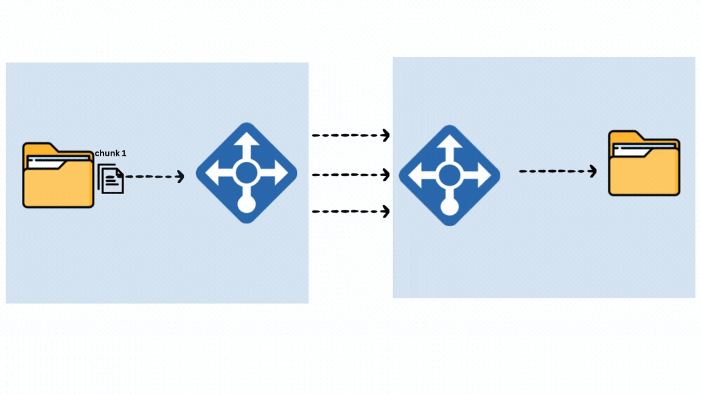

# Parallel File Streaming with TCP 

## Concept diagram
<div align="center">
  
</div>

## overview
This project implements parallel file streaming in Go using multiple TCP connections between a client and a server. The sender reads a large file in chunks and transmits them concurrently across multiple TCP connections to client . __Synchronization is achieved using a mathematical modulo operation, which also acts as a load balancer for distributing chunks efficiently among connections__.

On the receiver (client) side, chunks are reassembled in the correct order to reconstruct the original file. This approach significantly improves number byte in flight , making it faster than traditional single-connection transfers. However, __the method utilizes high network bandwidth due to the parallel transmission__.


## synchrozing chunks/packets between client and server 

file is read is chunck and each chunk will be sent to connection with  equation , chunk_id is round count with counts upto total connections , which is efficient way of caluclation mod of chunk id and total connection , it is similar principle of __Round Robin Load Balancer algorithm ,This ensures an even distribution of chunks across multiple connections, optimizing parallel transmission and balancing the load efficiently__.
```
  connection id = (chunk id ) % total connections 
```


#### Variables Used

- **`connection id`** (`int`): increamental counter value , asssigned to connection as identifier 
- **`chunk id `** (`int`): increamental counter of chunk read from file 


## Workings 

The __chunk size, parallelism level, input file, and output file are read from config.json to avoid unnecessary complexity__. Additionally, __we do not use encoding, serialization, or compression—the file is read as raw bytes and directly transferred to the client__. This minimizes processing overhead and ensures faster data transmission. By leveraging parallel TCP connections, the system efficiently handles large file transfers, improving speed at the cost of higher network bandwidth usage. This design is ideal for scenarios where performance is critical and configuration flexibility is not a primary concern.


## Run Locally

clone repo to local
``` bash
git clone https://github.com/SValanukonda/fileStreamer
```

change directory
``` bash
cd fileStreamer
```

change config params in config.json 

```
vim config.json
```
start listner server, it needs tcp address from config.json
```
go run filStreamer.go -listen
```

start Sender Server 
```
go run fileStreamer.go -send
```

